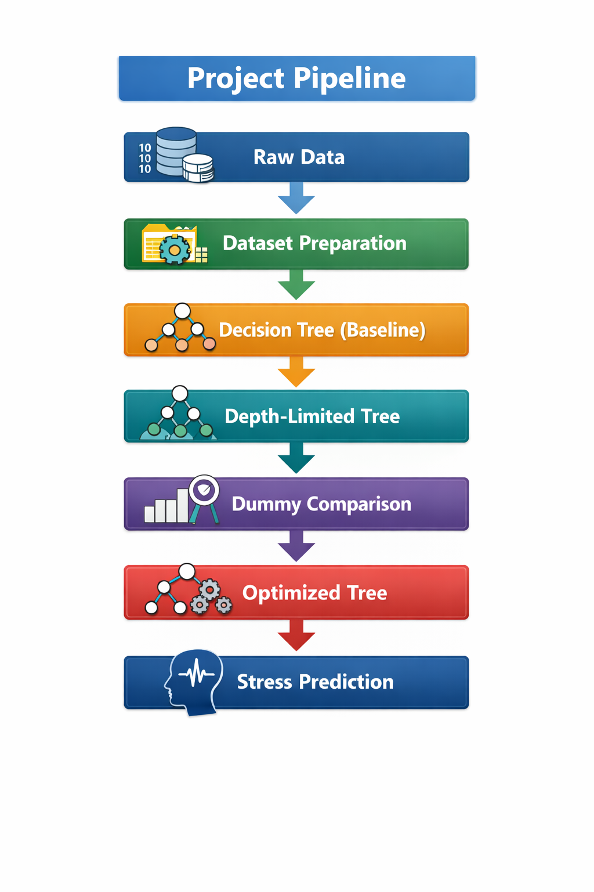

# Aion Player Stress Detection

## Overview

This project focuses on **automatic detection of player fatigue and stress** using in-game behavioral data from the MMORPG *Aion*.  
Using **decision tree classifiers**, we model whether a player shows signs of stress based on gameplay metrics, with special attention to **class imbalance**, **false negatives**, and **model interpretability**.

The motivation is practical: prolonged gameplay can negatively impact mental health, and regulations on digital wellbeing increasingly require **early detection and preventive intervention**. An interpretable model such as a decision tree allows actionable decisions while remaining auditable.



---

## Project Stages

### 1. Dataset Preparation

The raw dataset contains gameplay metrics for thousands of players, including missing values and unlabeled cases.

Key steps:
- Load and inspect raw gameplay data.
- Preserve all variables (no feature removal).
- Remove only rows with invalid or missing labels where required by the model.
- Separate labeled players from unlabeled ones for later inference.
- Produce a cleaned dataset suitable for supervised learning.

Output:
- `dades_aion_preparat.csv` – cleaned and model-ready dataset.

#### Dataset Summary

| Aspect                | Value                  |
|----------------------|------------------------|
| Game                 | Aion                   |
| Players              | 9,721                  |
| Features             | 25 (numerical)         |
| Target variable      | `class` (0 / 1)        |
| Missing labels       | Yes (NaN)              |
| Class imbalance      | Severe (class 1 minor) |

---

### 2. Building the Initial Decision Tree

A baseline **DecisionTreeClassifier** is trained using:
- Default hyperparameters.
- `criterion="entropy"` to maximize information gain.

Evaluation focuses not only on accuracy, but on:
- Precision, recall, F1-score
- **False Positive Rate (FPR)**
- **False Negative Rate (FNR)**

This stage establishes a reference point and exposes overfitting and sensitivity issues, especially for the minority class (stressed players).

---

### 3. Modifying the Decision Tree

To reduce overfitting, the decision tree is constrained by:
- Limiting maximum depth (`max_depth`).

This forces simpler decision rules and improves generalization, at the cost of reduced sensitivity to stress cases.  
The trade-off between model complexity and recall is explicitly analyzed.

---

### 4. Comparing Algorithms

A **DummyClassifier** with strategy `most_frequent` is used as a baseline.

Purpose:
- Demonstrate why accuracy alone is misleading.
- Highlight the impact of severe class imbalance.
- Show that trivial models can achieve high accuracy while completely failing at stress detection.

This comparison validates the decision tree as a meaningful model rather than an illusion of performance.

#### Model Comparison Table

| Model                     | Recall (Class 1) | FNR   | FPR   | Overfitting |
|---------------------------|------------------|-------|-------|-------------|
| Decision Tree (full)      | High             | Medium| Low   | High        |
| Decision Tree (depth=5)   | Medium           | Medium| Medium| Low         |
| Dummy (most_frequent)     | 0.00             | 1.00  | 0.00  | None        |
| Optimized Decision Tree   | Highest          | Lowest| Low   | Low         |


---

### 5. Model Optimization

The final stage improves the decision tree without changing the algorithm.

Techniques applied:
- Stratified train/test split.
- Feature scaling for consistency.
- Hyperparameter tuning using **GridSearchCV**.
- Optimization driven by **F1-macro**, not accuracy.

The optimized model achieves:
- Better balance between FPR and FNR.
- Improved detection of stressed players.
- Reduced overfitting.
- Applicability to previously unlabeled players.

---

## Conclusion

This project demonstrates that:
- Decision trees are viable and interpretable tools for stress detection in gaming data.
- Class imbalance is the dominant challenge and must guide evaluation.
- Accuracy is insufficient; FNR and recall are critical in health-related contexts.
- Controlled model complexity and proper optimization significantly improve reliability.

The resulting model can be used as a **pre-screening tool** to prioritize manual review and preventive actions in digital wellbeing systems.

---

## Repository Structure

```
data/
├── dades_aion.csv
├── dades_aion_preparat.csv

src/
├── decision_tree.py
├── optimitzacio.py
README.md
```

